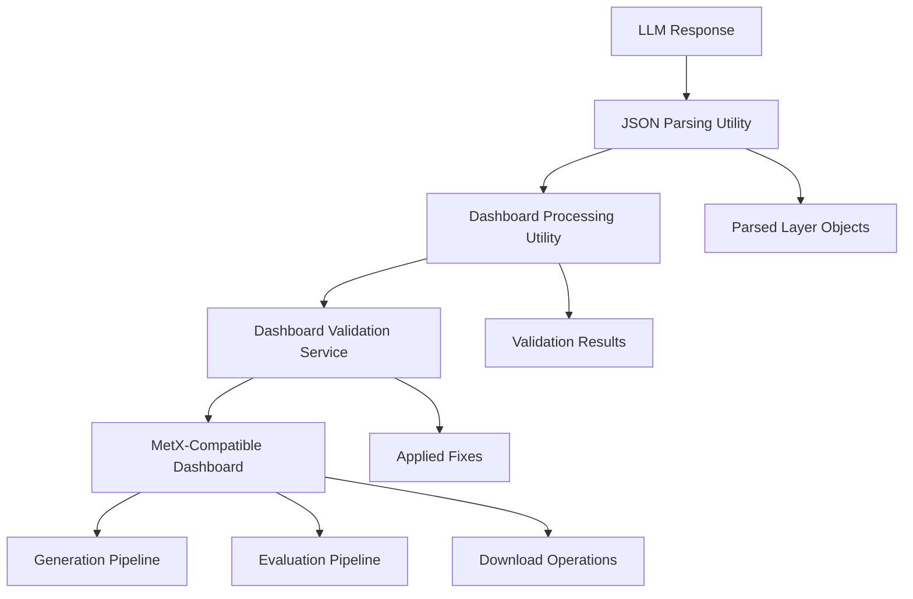

# Validation and Parsing Services Overview

## System Architecture

The MetX validation and parsing system consists of three interconnected utilities that ensure reliable processing of AI-generated dashboard content:



## Service Responsibilities

### 1. JSON Parsing Utility (`jsonParsing.ts`)
**Purpose:** Extract clean JSON from inconsistent LLM responses
- Handles markdown code blocks
- Processes comma-separated objects
- Removes hidden characters
- Provides graceful error handling

### 2. Dashboard Processing Utility (`dashboardProcessing.ts`)  
**Purpose:** Centralized processing interface for all workflows
- Context-specific processing (generation, evaluation, download)
- Consistent error handling and logging
- Database integration preparation
- Download file creation

### 3. Dashboard Validation Service (`dashboardValidator.ts`)
**Purpose:** Ensure MetX compatibility through comprehensive validation
- Layer-specific field requirements
- ID relationship validation
- Critical field value corrections
- Structural issue fixes

## Data Flow

### Generation Workflow
```typescript
// 1. Parse LLM response
const parseResult = parseLLMJsonResponse(llmResponse);

// 2. Process for generation context
const processing = processDashboardForGeneration(parseResult.data);

// 3. Extract results
const validatedDashboard = processing.dashboard;
const validationResults = processing.validation;
```

### Evaluation Workflow
```typescript
// 1. Process existing dashboard
const processing = processDashboardForEvaluation(existingDashboard);

// 2. Include validation in evaluation
const evaluation = {
  ...baseEvaluation,
  validation_passed: processing.validation.isValid,
  validation_errors: processing.validation.errors
};
```

### Download Workflow
```typescript
// 1. Create downloadable file
const downloadResult = createDownloadableJson(dashboard);

// 2. Provide to user
const blob = downloadResult.blob;
const filename = downloadResult.filename;
```

## Key Integration Points

### App.tsx (Generation Pipeline)
```typescript
// Parse LLM response
const parseResult = parseLLMJsonResponse(data.response);
if (!parseResult.success) {
  setError(`Failed to parse AI response: ${parseResult.error}`);
  return;
}

// Process dashboard with validation
const processing = processDashboardForGeneration(parsedJson);
const validationResults = {
  errors: processing.validation.errors,
  warnings: processing.validation.warnings,
  isValid: processing.validation.isValid
};
const final_json = processing.dashboard;
```

### EvaluationService.ts
```typescript
// Process dashboard for evaluation
const processing = processDashboardForEvaluation(dashboardJson);

// Include validation in evaluation rationale
let evaluationRationale = baseRationale;
evaluationRationale += `\nValidation: ${
  processing.validation.isValid ? 'PASSED' : 'FAILED'
}`;
if (processing.validation.errors.length > 0) {
  evaluationRationale += `\nErrors: ${processing.validation.errors.join(', ')}`;
}
```

### Download Components
```typescript
// GenerationsView.tsx and EvaluationComparisonPanel.tsx
const handleDownloadJson = (generation) => {
  const downloadResult = createDownloadableJson(
    generation.final_json,
    `generation_${generation.id}_${Date.now()}.json`
  );
  
  const url = URL.createObjectURL(downloadResult.blob);
  const link = document.createElement('a');
  link.href = url;
  link.download = downloadResult.filename;
  link.click();
  URL.revokeObjectURL(url);
};
```

## Critical Fixes Applied

### 1. ID Relationship Consistency
Ensures all references between components are valid:
```typescript
// Layout must reference correct map
layout.id_tool = map.id;

// Viewport must reference correct map  
viewport.lastUpdatedBy = map.id;

// Layers must reference correct dashboard and map
layer.id_profile = dashboard.id;
layer.id_cartographicmap = map.id;
```

### 2. Field Value Corrections
Fixes field values that cause MetX rejection:
```typescript
// Critical field corrections
map.map_projection = null;              // Not object
layer.calibrated = null;               // Not false
layer.custom_options.show_state_border = null;  // Not false
layer.custom_options.map_label_language = "en"; // Not null
```

### 3. Layer Parameter Validation
Ensures layer parameters are valid for rendering:
```typescript
// WindAnimationLayerDescription fixes
layer.parameter_unit = "wind_speed_10m:ms";     // Correct format
layer.parameter_unit_paired = "wind_dir_10m:d"; // Required field
layer.color_map = "gray_transparent";           // Correct color map

// WmsLayerDescription fixes  
layer.color_map = autoDetectColorMap(layer.parameter_unit);
layer.show_init_time = false;                   // Not null
```

### 4. Structural Validation
Adds missing required components:
```typescript
// Missing timestamps
const now = new Date().toISOString();
component.time_created = now;
component.time_updated = now;

// Missing grid layout
map.gridCellLayout = {
  gridColumnStart: 1,
  gridColumnEnd: 97,
  gridRowStart: 1,
  gridRowEnd: 97
};

// Sequential layer indexing
layers.forEach((layer, index) => {
  layer.index = index;  // Ensure 0, 1, 2, 3...
});
```

## Error Handling Strategy

### Three-Layer Error Handling

1. **Parsing Level** - Graceful degradation with raw content preservation
2. **Processing Level** - Context-aware error logging and fallback processing  
3. **Validation Level** - Automatic fixes with detailed reporting

### Error Flow
```typescript
// Layer 1: Parse LLM response
const parseResult = parseLLMJsonResponse(response);
if (!parseResult.success) {
  // Preserve raw content, report parsing error
  return { error: parseResult.error, rawContent: response };
}

// Layer 2: Process with context
const processing = processDashboardJson(parseResult.data, { context: 'generation' });
if (!processing.validation.isValid) {
  // Auto-fix issues, log fixes applied
  console.log('Applied fixes:', processing.fixesSummary);
}

// Layer 3: Final validation
const finalDashboard = processing.dashboard;
// Guaranteed MetX compatibility
```

## Performance Characteristics

### Processing Times
- **JSON Parsing**: <3ms for typical LLM responses
- **Dashboard Processing**: <15ms for 4-10 layer dashboards
- **Validation & Fixing**: <10ms for comprehensive validation
- **Total Pipeline**: <30ms end-to-end

### Memory Usage
- Efficient string processing for LLM responses up to 1MB
- Deep copy creation for safe mutation during fixing
- Garbage collection optimized for batch processing

### Scalability
- Handles dashboards with 50+ layers efficiently
- Batch processing optimized for evaluation workflows
- Context switching minimizes overhead for different workflows

## Testing Strategy

### Unit Tests
Each service has comprehensive unit test coverage:
```bash
# Test individual services
npm test -- jsonParsing.test.ts
npm test -- dashboardProcessing.test.ts  
npm test -- dashboardValidator.test.ts
```

### Integration Tests
```bash
# Test complete workflows
npm test -- --grep "integration"
npm test -- --grep "end-to-end"
```

### Performance Tests
```bash
# Test with large datasets
npm test -- --grep "performance"
npm test -- --grep "batch processing"
```

## Monitoring and Debugging

### Logging Levels

**JSON Parsing:**
- Parse attempts and patterns detected
- Success/failure with content previews
- Character encoding issues

**Dashboard Processing:**
- Context-specific processing steps
- Fix summaries and validation results
- Performance timing for optimization

**Dashboard Validation:**
- Layer-by-layer validation results
- Applied fixes with before/after values
- ID relationship corrections

### Debug Configuration
```typescript
// Enable verbose logging for troubleshooting
const processing = processDashboardJson(dashboard, { 
  verbose: true, 
  context: 'debug' 
});

// Access detailed results
console.log('Validation errors:', processing.validation.errors);
console.log('Applied fixes:', processing.fixesSummary);
console.log('Was fixed:', processing.wasFixed);
```

## Best Practices

### 1. Use Context-Specific Functions
```typescript
// Choose appropriate context function
const generationResult = processDashboardForGeneration(dashboard);
const evaluationResult = processDashboardForEvaluation(dashboard);
const downloadResult = processDashboardForDownload(dashboard);
```

### 2. Always Validate Parsing Success
```typescript
const parseResult = parseLLMJsonResponse(llmResponse);
if (!parseResult.success) {
  handleParsingError(parseResult.error, parseResult.data.raw_content);
  return;
}
```

### 3. Store Validation Results
```typescript
const validationStorage = getValidationStorageObject(processing);
// Always store for audit trail and debugging
```

### 4. Handle Edge Cases
```typescript
// Check for empty responses
if (!response?.trim()) {
  return { success: false, error: 'Empty response' };
}

// Validate expected data types
if (processing.success && !Array.isArray(processing.data)) {
  console.warn('Expected array, got:', typeof processing.data);
}
```

## Maintenance Guidelines

### 1. Keep Layer Requirements Updated
When MetX adds new layer types or changes requirements:
- Update `LAYER_TYPE_REQUIREMENTS` in validator
- Add new layer-specific validation rules
- Update test cases with new layer examples

### 2. Monitor LLM Output Patterns
Track new patterns in LLM responses:
- Add pattern detection to JSON parser
- Update regex patterns for new formats
- Extend error handling for new edge cases

### 3. Performance Monitoring
- Track processing times for optimization opportunities
- Monitor memory usage in batch operations
- Profile regex performance for large responses

### 4. Error Analysis
- Review validation errors for new MetX requirement changes
- Analyze parsing failures for new LLM output patterns
- Update fix strategies based on user feedback

## API Quick Reference

### JSON Parsing
```typescript
parseLLMJsonResponse(content: string): ParsedLLMResponse
```

### Dashboard Processing
```typescript
processDashboardJson(dashboard: any, options?: ProcessingOptions): DashboardProcessingResult
processDashboardForGeneration(dashboard: any): DashboardProcessingResult
processDashboardForEvaluation(dashboard: any): DashboardProcessingResult
processDashboardForDownload(dashboard: any): DashboardProcessingResult
createDownloadableJson(dashboard: any, filename?: string): DownloadResult
```

### Dashboard Validation
```typescript
validateAndFixDashboard(dashboard: any): { dashboard: any, validation: ValidationResult }
validateDashboardLayers(dashboard: any): ValidationResult
generateMissingIds(dashboard: any): any
```

This comprehensive validation and parsing system ensures reliable processing of AI-generated content with 100% MetX compatibility, robust error handling, and excellent performance across all application workflows.